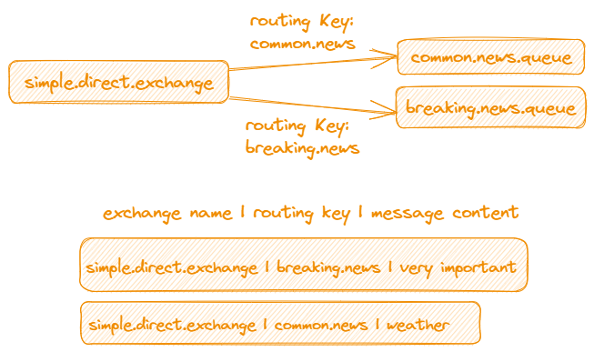
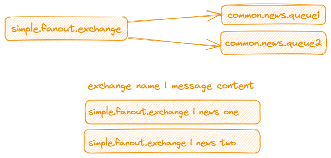
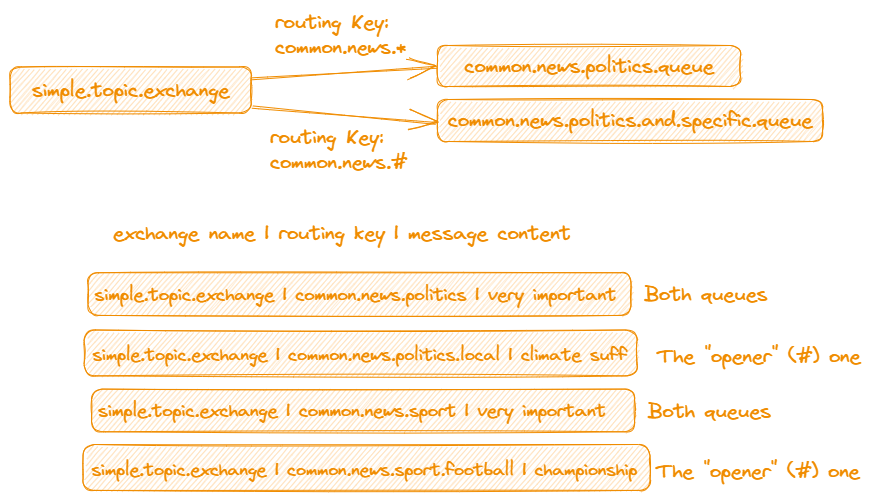
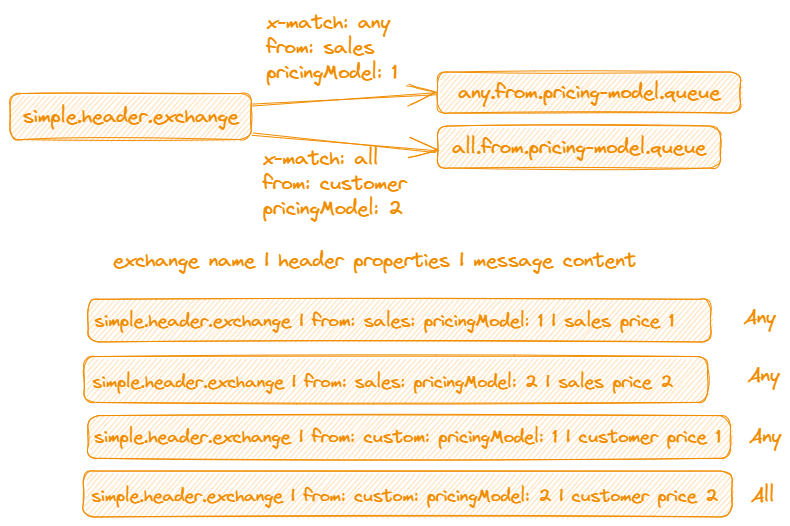
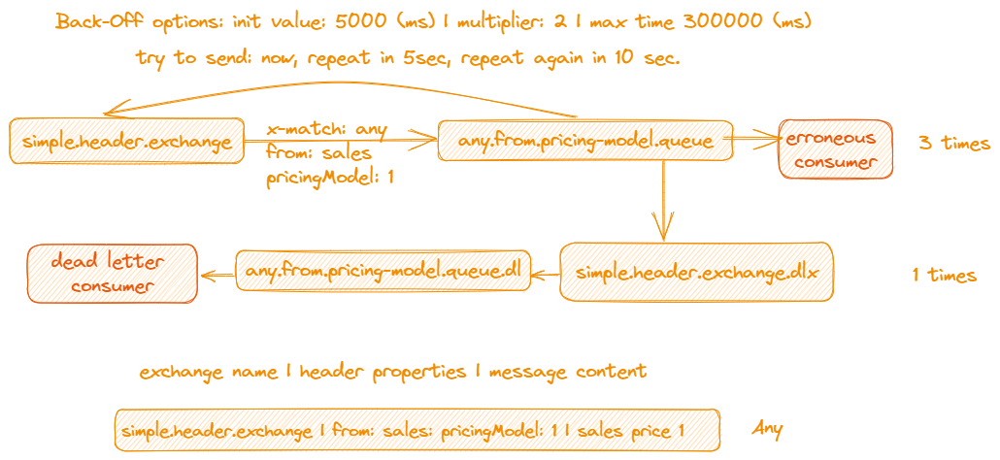
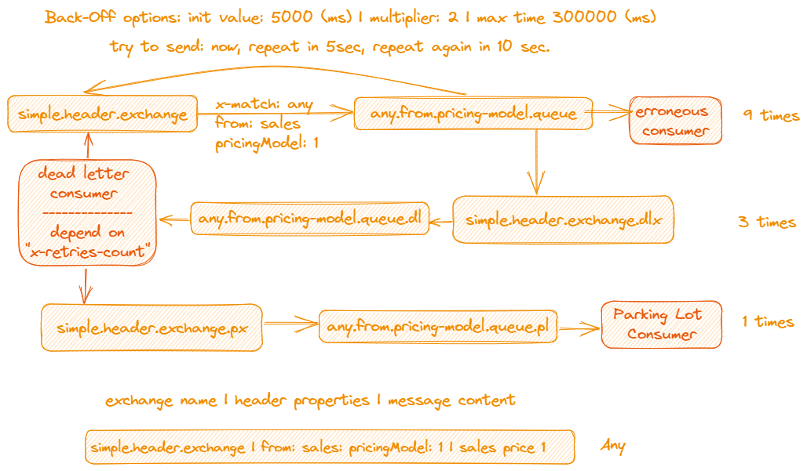
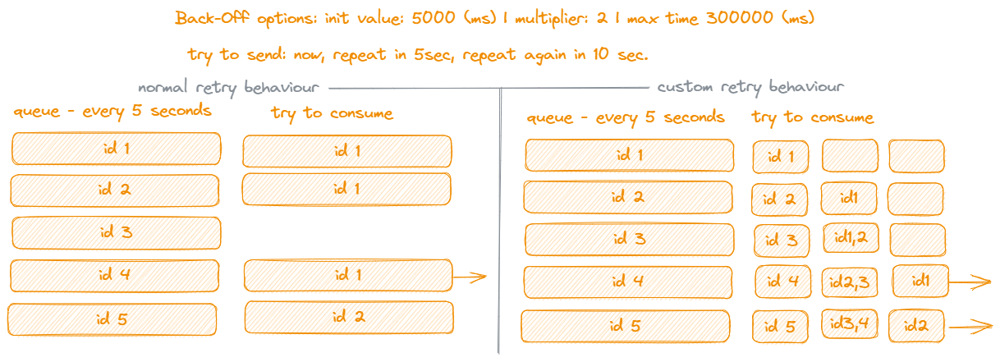

# Use Cases

## Introduction

On this site only the options are listed which can be a part of a use case.

## Message Queuing Patterns

With AMQP/RabbitMQ several pattern can be implemented listed in the tutorials part ot the [site](https://www.rabbitmq.com/getstarted.html).

1. Simple producer/consumer
2. Work queues
3. Publish/Subsribe
4. Routing
5. Topics
6. RPC

## Structure overview of the Messaging in a Spring boot application

* Exchange
* Queue
* Message
* Error Handling Strategies

### Exchange

## Direct
  

## Fanout

## Topic

## Header

### Queue

* Classic - used in this project
* Quorum Queues
* Streams

### Message

* SimpleMessageConverter - used in this project
  * Byte Array
  * Text
  * Serialized Object
* Jackson2MessageConverter
  * JSON - used in this project
  * XML

### Error Handling Strategies

## Dead letter exchange and queue

## Parking lot

### Extra

 * Parallel message requeuing - the extra parallel message requeuing strategy from the [baeldung](https://www.baeldung.com/spring-amqp-exponential-backoff) page was used here.

